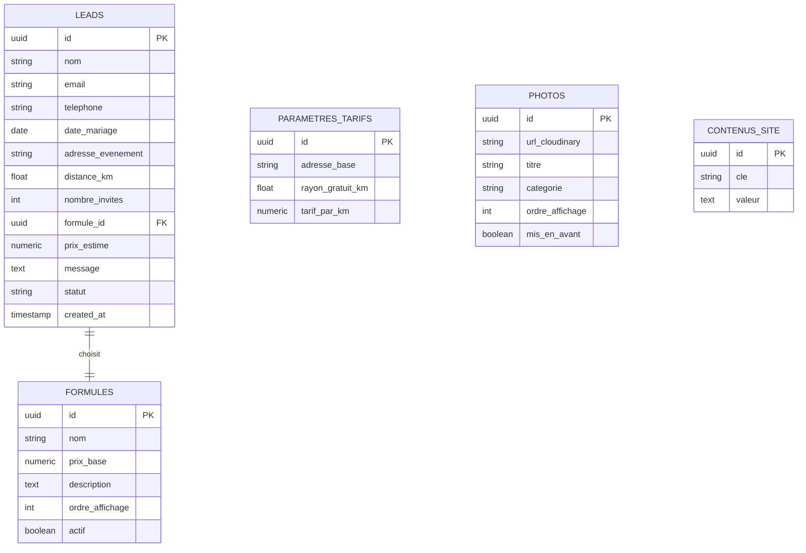
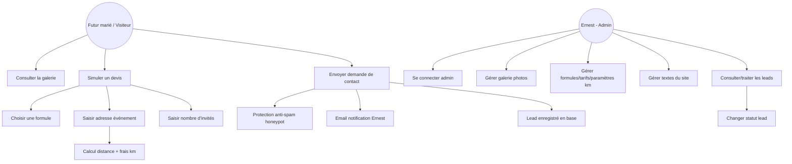

# Fondations du Projet — PortfolioPhotographe
> mentalyas · Full-Stack Dev
> Date : 2026-07-28
> Statut : Brainstorm initial

---

## 1. Concept Global

Site vitrine personnel sur mesure pour Ernest, photographe événementiel spécialisé mariage (photojournalisme, lumière naturelle, retouche discrète). Objectif : remplacer Adobe Portfolio (jugé trop générique) par un site à sa propre signature visuelle, avec effet "wahou" immédiat, pour closer rapidement des mariages. Cible principale : futurs mariés en recherche de photographe. Le site expose une galerie de ses meilleures photos et intègre un funnel commercial à 2 paliers : un simulateur de devis transparent anonyme (3 formules + frais de déplacement, voir `docs/modules/DEVIS.md`) pour lever la friction du prix à froid, puis — dès la création d'un compte client — la construction directe d'un **dossier complet** (options à la carte + logistique détaillée du jour J, voir `docs/modules/DOSSIER.md`) sans attendre signature ni paiement ("le piège gentil" : le client pense affiner son devis, il construit en réalité son dossier). Les demandes sont centralisées dans un mini-CRM propre au photographe (`docs/modules/CMS.md`).

## 2. Fonctionnalités

### Fonctionnalités core (MVP)
- [ ] Galerie vitrine des meilleures photos (portfolio curé, pas la livraison client — celle-ci reste sur Pixieset)
- [ ] Simulateur de devis avec 3 formules de base :
  - Event unique — à partir de 350€
  - Demi-journée — à partir de 650€
  - Journée complète — à partir de 1250€
- [ ] Calculateur de frais de déplacement : gratuit jusqu'à un rayon X km (configurable), puis tarif/km (configurable) — géocodage adresse client + Haversine (voir §6)
- [ ] Champ nombre d'invités dans le formulaire (informatif uniquement, n'impacte pas le prix affiché)
- [ ] Formulaire de contact/devis avec protection anti-spam (honeypot + rate limiting par IP)
- [ ] Envoi email de notification (Resend) à chaque nouvelle demande
- [ ] Dashboard admin (accès unique, Ernest) : liste des leads avec statut (nouveau / configuré / contacté / signé)
- [ ] CMS admin sur-mesure : upload/gestion des photos de la galerie (vers Cloudinary), édition des textes du site, édition des formules/tarifs/paramètres du calculateur km, CRUD complet du catalogue d'options à la carte, form builder des champs du dossier — tout piloté en base, sans redéploiement
- [ ] Compte client (email + mot de passe, Supabase Auth) + dossier complet : options à la carte à prix fixes (album, coffret photo gravé laser, set studio ambulant Godox AD600 Pro II, shooting mariés seuls/plan pluie) ET questionnaire logistique dynamique (adresse exacte, horaires, contacts...) entièrement configurable par Ernest en CMS (voir `docs/modules/DOSSIER.md`)

### Fonctionnalités secondaires (v2+)
- [ ] Formules/offres supplémentaires à définir
- [ ] Page(s) dédiées enrichies (galerie filtrable par mariage/catégorie, page Tarifs détaillée) selon ce que la session design fera émerger
- [ ] Comptes admin multiples (si Ernest travaille avec un(e) assistant(e))

### Hors scope (explicitement exclu)
- Paiement en ligne / acompte carte bancaire
- Prise de rendez-vous / calendrier de réservation automatisé
- Hébergement des livrables clients (reste sur Pixieset, hors périmètre de ce site)
- Blog

## 3. Structure de Base de Données
Supabase (PostgreSQL). Une seule table de configuration singleton pour les paramètres globaux du calculateur.

> Schéma complet des modules Devis et Dossier (dont `dossiers`, `services_carte`,
> `dossier_options`, `dossier_champs`, `dossier_reponses`, `rate_limit_log`) détaillé
> dans `docs/modules/DEVIS.md` §6 et `docs/modules/DOSSIER.md` §7 — vue d'ensemble
> simplifiée ci-dessous.

### Entités principales
| Entité | Champs clés | Relations |
|--------|-------------|-----------|
| `leads` | id, nom, email, telephone, date_mariage, lieu_evenement, adresse_evenement, distance_km, nombre_invites, formule_id, prix_estime, message, statut (nouveau/contacte/signe), created_at | → `formules` |
| `formules` | id, nom, prix_base, description, ordre_affichage, actif | ← `leads` |
| `parametres_tarifs` | id (singleton), adresse_base, rayon_gratuit_km, tarif_par_km | — |
| `photos` | id, url_cloudinary, public_id_cloudinary, titre, categorie, ordre_affichage, mis_en_avant, created_at | — |
| `contenus_site` | id, cle (ex: hero_titre, about_texte), valeur | — |

### Diagramme ERD (Mermaid)

## 4. Diagrammes Use Cases (Mermaid)

## 5. Stack Technologique Recommandée
| Couche | Technologie | Justification |
|--------|-------------|---------------|
| Frontend | Next.js (App Router) + TypeScript + Tailwind | SSR/SSG → référencement Google local (crucial pour être trouvé par des futurs mariés), déploiement Vercel natif |
| Animations | Framer Motion | Effet "wahou" demandé, scroll/transitions immersives |
| Formulaires | React Hook Form + Zod | Validation devis/contact stricte, cohérent avec le workflow frontend global |
| Backend | Next.js Route Handlers / Server Actions | Colocalisé avec le frontend, pas de service séparé nécessaire |
| Base de données | Supabase (Postgres) | Gratuit, leads + config tarifs + contenus éditables |
| Stockage photos | Cloudinary | Gratuit (tier généreux), optimisation/transformation d'images à la volée |
| Auth admin | Supabase Auth (email/password) | Un seul compte (Ernest), pas de gestion de rôles nécessaire |
| Auth client | Supabase Auth (email/password) | Compte léger pour construire le dossier, RLS scopée à `auth.uid()`, vérification email requise avant envoi final (voir `docs/modules/DOSSIER.md`) |
| Email transactionnel | Resend | Notification à chaque nouveau lead, gratuit jusqu'à 3000/mois |
| Géocodage | Nominatim (OpenStreetMap) | Gratuit, sans clé API, suffisant pour un calcul de distance à vol d'oiseau |
| Hébergement | Vercel | Gratuit, domaine `ernestphotography.com` (Namecheap) déjà acheté, à pointer vers Vercel |
| CI/CD | Vercel (déploiement auto sur push) | Intégré, aucun outil supplémentaire nécessaire |

## 6. Algorithmes & Patterns Techniques

- **Calcul du devis** — Fonction pure côté serveur : `prix_estime = prix_base(formule) + max(0, distance_km - rayon_gratuit_km) * tarif_par_km`. Tous les paramètres (`prix_base`, `rayon_gratuit_km`, `tarif_par_km`) viennent de la DB (tables `formules` / `parametres_tarifs`), jamais codés en dur — Ernest les édite depuis le CMS sans redéploiement.
- **Distance à vol d'oiseau (Haversine)** — Géocodage de l'adresse événement + adresse de base (Ernest) via Nominatim, puis formule de Haversine pour la distance en km. Approximation assumée (pas de distance routière) pour rester 100% gratuit sans quota bloquant — à documenter clairement comme "estimation" côté UI pour éviter toute contestation client.
- **Honeypot anti-spam** — Champ caché (CSS `display:none`, jamais rempli par un humain) dans le formulaire ; toute soumission avec ce champ rempli est silencieusement rejetée. Combiné à un rate limiting simple par IP (ex: 5 soumissions/heure) sur le Route Handler.
- **CMS piloté par DB** — Photos, textes et paramètres tarifaires en base plutôt qu'en dur dans le code → Ernest peut tout modifier depuis l'admin sans toucher au code ni redéployer.
- **Server Actions Next.js** — Soumission du formulaire de devis/contact directement en Server Action (pas de client-side fetch manuel), validation Zod côté serveur en dernier rempart même si déjà validé côté client.

## 7. Sécurité — Bloc Dédié

### Niveau de sensibilité des données
**Moyen** — Le site collecte des données personnelles de prospects (nom, email, téléphone, adresse de l'événement, date de mariage) et, via le dossier complet, des informations plus détaillées (adresse exacte des lieux, contacts prestataires, notes personnelles) ainsi que des comptes clients avec mot de passe (hash géré nativement par Supabase Auth, jamais stocké en clair). Pas de données bancaires ni de paiement en ligne (hors scope). Justifie une vigilance RGPD standard sans être un profil "élevé" (pas de données de santé, pas de paiement).

### Vulnérabilités à anticiper
| Risque | Vecteur | Mitigation |
|--------|---------|------------|
| Injection SQL | Requêtes vers Supabase | Client Supabase (requêtes paramétrées), jamais de SQL concaténé |
| XSS | Textes du CMS affichés sur le site public | Sanitization des contenus, pas de `dangerouslySetInnerHTML` sans sanitizer (ex: DOMPurify si HTML riche nécessaire) |
| Spam / abus formulaire public | Bots automatisés sur le formulaire de contact | Honeypot + rate limiting IP (voir §6) |
| Accès non autorisé à l'admin | Route `/admin` exposée publiquement | Supabase Auth obligatoire + middleware Next.js protégeant toutes les routes admin, jamais de logique d'autorisation uniquement côté client |
| Fuite de données leads (PII) | Table `leads` accessible via l'API Supabase | Row Level Security (RLS) Supabase activée, lecture/écriture leads réservée au rôle admin authentifié |
| Upload photo malveillant | Formulaire d'upload CMS | Upload restreint aux types image, passage systématique par Cloudinary (pas de stockage de fichier brut sur le serveur) |

### Exceptions & Gestion d'erreurs
- Ne jamais exposer les stack traces en production (pages d'erreur Next.js génériques).
- Messages d'erreur formulaire compréhensibles côté visiteur, sans détail technique.
- Logging structuré côté serveur pour les erreurs d'API (géocodage, email) — jamais de PII en clair dans les logs.
- Si le géocodage échoue (adresse introuvable), fallback : afficher le prix des formules sans frais de déplacement + inviter le visiteur à préciser via le formulaire.

### Checklist sécurité minimale
- [ ] Authentification admin sécurisée via Supabase Auth (hash géré par Supabase, pas de gestion manuelle de mots de passe)
- [ ] HTTPS obligatoire (natif Vercel)
- [ ] Toutes les clés (Supabase, Cloudinary, Resend) en variables d'env, jamais commitées
- [ ] Rate limiting sur le endpoint de soumission de formulaire
- [ ] Validation Zod côté serveur sur toutes les entrées (formulaire devis/contact)
- [ ] RLS Supabase activée sur `leads`, `parametres_tarifs`, `contenus_site` (écriture réservée à l'admin authentifié)
- [ ] Consentement RGPD explicite sur le formulaire (case à cocher ou mention claire) avant collecte des données de contact

## 8. Références
| Référence | Ce qui est inspirant | Ce qu'on fait différemment |
|-----------|---------------------|---------------------------|
| Adobe Portfolio (actuel) | Simplicité de mise à jour | Design trop générique/template, pas de signature propre, pas de simulateur de devis intégré → remplacé par un site sur mesure |
| Instagram (actuel) | Portée, découverte organique | Reste un canal complémentaire, pas remplacé — le site devient la vitrine "propriétaire" qui convertit |

> Direction visuelle non encore définie — à explorer dans une session design dédiée (prompt structuré pour Claude Design, itération sur plusieurs propositions avant de figer le frontend).

## 9. Vers le Cahier des Charges

### Résumé exécutif (pour business plan)
Ernest, photographe événementiel mariage, remplace sa vitrine Adobe Portfolio générique par un site sur mesure conçu pour convertir rapidement les futurs mariés en clients signés. Le levier principal est la transparence tarifaire immédiate (simulateur de devis avec frais de déplacement calculés automatiquement), combinée à une galerie qui reflète sa signature visuelle (photojournalisme, lumière naturelle). Stack 100% gratuite (Next.js/Vercel/Supabase/Cloudinary/Resend), CMS sur mesure pour une autonomie totale sans dépendance à un développeur pour les mises à jour courantes (photos, textes, tarifs).

### Points ouverts / décisions restantes
- [x] Direction visuelle/design — retenue (mock Claude Design, direction 5a), front-end implémenté
- [x] Modules Devis, Dossier (fusion configurateur + logistique) et CMS brainstormés — voir `docs/modules/`
- [x] Mécanisme d'engagement du dossier — retenu : "la pellicule qui se développe" (voir `docs/modules/DOSSIER.md` §5)
- [ ] Structure exacte des pages restantes (compte, dossier) — dépend de la session design pour l'animation pellicule
- [ ] Valeurs précises des paramètres tarifaires (rayon gratuit exact en km, tarif/km, adresse de base)
- [ ] Prix exacts des options à la carte (album, coffret gravé laser, studio ambulant, shooting mariés seuls)
- [ ] Champs exacts du questionnaire logistique par défaut (au-delà des suggestions de `DOSSIER.md` §3.2)
- [ ] Texte de consentement RGPD exact du formulaire

### Prochaines étapes
1. Valider ce document de fondation
2. Session design dédiée (brainstorm visuel → prompt Claude Design → itération → choix front-end)
3. Rédiger le cahier des charges complet une fois le design validé
4. Activer l'équipe d'agents IT (Hub & Spoke) pour l'implémentation : PO → Architect/UI/UX → Backend/Frontend → QA → DevOps
