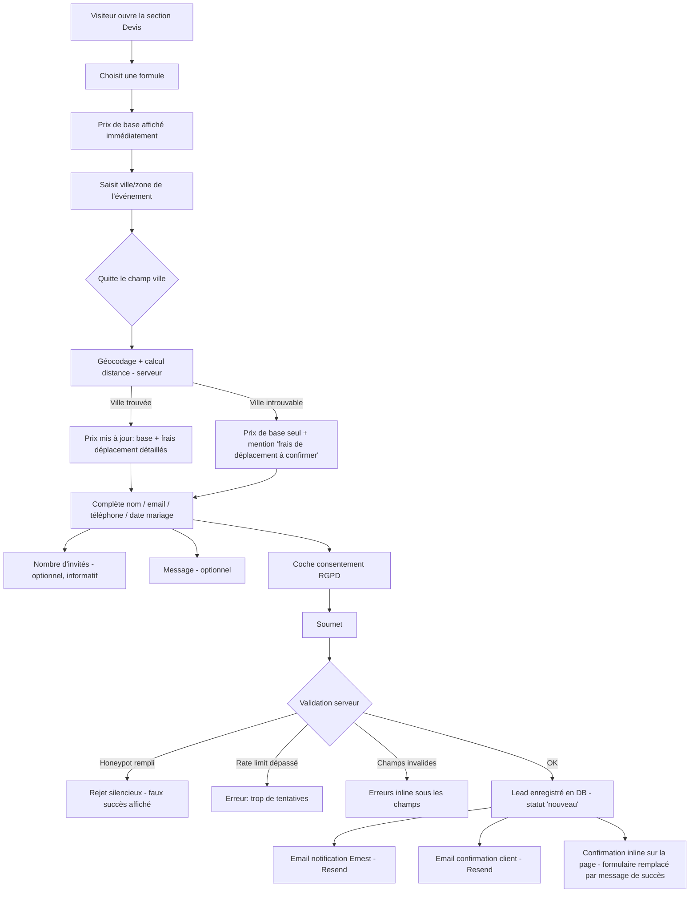

# Module — Simulateur de devis & capture de lead
> PortfolioPhotographe · Brainstorm module · 2026-07-29
> Portée : simulateur de devis + capture du lead uniquement. Le "dossier client" complet
> (adresse exacte, planning détaillé du jour) est un module séparé, à brainstormer après
> signature — hors scope ici.

---

## 1. Concept

Un formulaire à friction minimale qui donne un **prix estimé en temps réel** pendant que
le client remplit ses informations, puis capture la demande comme lead (email de
notification à Ernest + email de confirmation au client + enregistrement en base).
Le prix se construit progressivement : formule choisie, puis frais de déplacement dès
que la ville/zone de l'événement est renseignée.

## 2. Parcours utilisateur

## 3. Règles métier

### Prix en temps réel
- Le prix s'affiche **dès le choix de la formule** (prix de base seul).
- Le calcul des frais de déplacement se déclenche **au blur du champ ville/zone**
  (pas de debounce pendant la frappe) — respecte la limite Nominatim (1 requête/seconde,
  pas d'usage intensif). Un seul appel serveur par saisie d'adresse, jamais depuis le
  client directement (protège la clé d'usage Nominatim, évite l'abus).
- Affichage **détail complet**, jamais juste un total :
  `Demi-journée 650€ + déplacement 24€ (18km au-delà des 15km inclus) = 674€ estimés`
- Le mot "estimés" reste toujours visible à côté du total — c'est une estimation à vol
  d'oiseau, pas un devis contractuel final (le dossier client post-signature affinera).

### Frais de déplacement
- `frais = max(0, distance_km - rayon_gratuit_km) * tarif_par_km`
- Distance = Haversine entre les coordonnées géocodées de la ville/zone du client et
  l'adresse de base d'Ernest.
- L'adresse de base d'Ernest est géocodée **une seule fois** (à la sauvegarde dans le
  CMS), ses coordonnées (lat/lon) sont stockées — pas de re-géocodage à chaque devis.
- Si la ville n'est pas géocodable (faute de frappe, ville trop petite, etc.) : afficher
  le prix de base seul + mention "frais de déplacement à confirmer" — **ne bloque jamais
  la soumission**.

### Nombre d'invités
- Champ optionnel, **purement informatif** — n'impacte jamais le prix affiché.

## 4. Champs du formulaire

| Champ | Obligatoire | Validation |
|-------|-------------|------------|
| Formule | Oui | Une des 3 valeurs actives en DB |
| Nom | Oui | Non vide, max 100 car. |
| Email | Oui | Format email valide |
| Téléphone | Oui | Format téléphone valide (BE/FR) |
| Date du mariage | Oui | Date future (aucune limite de délai minimum) |
| Ville / zone de l'événement | Non | Texte libre — si vide, pas de frais de déplacement calculé |
| Nombre d'invités | Non | Entier positif |
| Message | Non | Texte libre, max 1000 car. |
| Consentement RGPD | Oui | Checkbox cochée obligatoire |
| Honeypot (champ caché) | — | Doit rester vide (piège à bots) |

## 5. Cas limites — base de tests

| # | Scénario | Comportement attendu |
|---|----------|----------------------|
| 1 | Ville non géocodable | Prix de base affiché, mention "frais à confirmer", soumission non bloquée |
| 2 | Date dans le passé | Erreur de validation inline, soumission bloquée |
| 3 | Email mal formé | Erreur de validation inline, soumission bloquée |
| 4 | Téléphone mal formé | Erreur de validation inline, soumission bloquée |
| 5 | Honeypot rempli (bot) | Faux succès affiché côté client, rien n'est enregistré ni envoyé côté serveur |
| 6 | Rate limit dépassé (même IP) | Message "trop de tentatives, réessayez plus tard", rien n'est enregistré |
| 7 | Double clic rapide sur Soumettre | Bouton désactivé pendant la requête, une seule soumission traitée |
| 8 | Timeout/erreur réseau Nominatim | Fallback gracieux, prix de base affiché, pas de blocage de la saisie |
| 9 | RGPD non coché | Soumission bloquée, erreur inline |
| 10 | Formule non sélectionnée | Soumission bloquée, erreur inline |
| 11 | Ville renseignée après coup (modifiée) | Nouveau blur → nouveau calcul, remplace l'ancien prix affiché |
| 12 | Requête géocodage lente (>2-3s) | État de chargement visible sur le prix (ex: léger skeleton/pulse) |

## 6. Architecture technique

- **`DevisForm`** (`'use client'`) — React Hook Form + Zod resolver, état du formulaire,
  affichage du prix en direct.
- **Server Action `estimateTravelFee(ville)`** — appelée au blur du champ ville :
  géocode via Nominatim, lit `parametres_tarifs` (coordonnées de base, rayon gratuit,
  tarif/km) + `formules` (prix de base) en DB, retourne le détail du prix.
- **Server Action `submitDevis(formData)`** — validation Zod serveur (dernier rempart
  même si déjà validé côté client), vérifie le honeypot, vérifie le rate limit, insère
  le lead en DB (statut `nouveau`), envoie les deux emails Resend (Ernest + client).
- **Rate limiting** — pas de Redis/Upstash dans la stack (contrainte 100% gratuit) :
  table Supabase `rate_limit_log` (ip, created_at), on compte les tentatives de la même
  IP sur la dernière heure avant d'autoriser l'insertion. Simple, gratuit, suffisant pour
  le volume attendu.
- **`parametres_tarifs`** — ajouter `lat`/`lon` (coordonnées de l'adresse de base,
  géocodées une fois à la sauvegarde CMS) en plus des champs déjà prévus dans
  `FONDATION.md` (`adresse_base`, `rayon_gratuit_km`, `tarif_par_km`).

## 7. Sécurité

- Honeypot + rate limiting IP (voir §6) contre le spam/bots.
- Validation Zod serveur systématique, jamais de confiance aveugle dans le client.
- RLS Supabase : écriture sur `leads` réservée aux Server Actions (clé service), lecture
  réservée à l'admin authentifié.
- Consentement RGPD explicite avant toute collecte — voir `FONDATION.md` §7.
- Aucune donnée sensible (PII) dans les logs serveur.

## 8. Prochaines étapes

- [ ] Implémenter `estimateTravelFee` + `submitDevis`
- [ ] Construire `DevisForm` (remplace les cercles statiques de la maquette 5a par le
      formulaire interactif)
- [ ] Brainstorm dédié : module "Dossier client" (post-signature, adresse exacte,
      planning détaillé de la journée)
