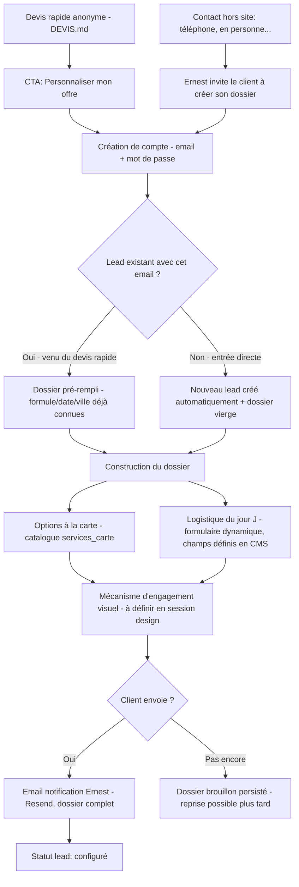

# Module — Dossier client (espace client + configurateur + logistique)
> PortfolioPhotographe · Brainstorm module · 2026-07-29
> **Correction de scope** : ce document fusionne et remplace l'ancien
> `CONFIGURATEUR.md` et l'idée initiale de "Dossier client post-signature" — ce sont en
> réalité **le même module**. Dès la création de compte, le client construit
> directement son dossier complet (options à la carte + logistique du jour J), sans
> attendre signature ni paiement. Le site ne traite aucun paiement (hors scope,
> confirmé).

---

## 1. Concept

Le "piège gentil" : le client pense juste affiner son devis, mais dès qu'il crée un
compte il entre dans la construction de son **dossier complet** — options à la carte
ET logistique détaillée du jour J. S'il va jusqu'au bout et envoie, Ernest a ~99% des
informations nécessaires pour organiser la journée, sans attendre un engagement formel.
Ernest garde la main sur la suite (contrat, acompte) **hors du site**, par les canaux
habituels — le site ne fait qu'accélérer et structurer la collecte d'informations.

## 2. Deux points d'entrée vers le même dossier

- **Peu importe le point d'entrée**, le client arrive dans le même dossier. Un lead est
  toujours créé/lié à la création de compte, même en entrée directe (sans être passé
  par le devis rapide) — tous les leads remontent dans le même dashboard CRM.
- Pas de statut "signé" bloquant l'accès : le dossier est ouvert dès le compte créé.
  `signé` reste un statut qu'Ernest positionne manuellement dans le CMS une fois
  l'accord conclu hors site (contrat, acompte, accord verbal...).

## 3. Contenu du dossier

### 3.1 Options à la carte (catalogue à prix fixes, géré en CMS)
Voir `CMS.md` §6 — `services_carte` : album, coffret photo gravé laser, studio
ambulant, shooting mariés seuls/plan pluie, etc. Prix figé en snapshot au moment de la
sélection (voir §5).

### 3.2 Logistique du jour J — formulaire dynamique
Contrairement aux options à la carte (catalogue de produits), la logistique est un
**questionnaire configurable** : Ernest peut créer/modifier/réordonner les champs
depuis le CMS, sans limite fixée dans le code (form builder générique — voir `CMS.md`
§6bis pour l'interface d'administration).

- Champs de départ suggérés (créés par défaut, modifiables) : adresse exacte du lieu de
  cérémonie, adresse exacte du lieu de réception (si différent), heure de début
  souhaitée, nombre d'invités précis, contact wedding planner/salle, notes libres
  (souhaits particuliers, contraintes).
- Chaque champ a : libellé, type (texte court / texte long / date / heure / nombre /
  email / téléphone / choix unique / choix multiple), obligatoire ou non, section de
  regroupement (ex: "Lieu & horaire", "Contacts", "Souhaits particuliers" — groupes de
  4-5 champs max, cohérent avec les règles d'ergonomie du CLAUDE.md global), ordre
  d'affichage, actif/inactif.
- Les réponses du client sont liées au champ par son id, pas par son libellé — si
  Ernest renomme un champ plus tard, les réponses déjà données restent lisibles et
  attribuées au bon champ.
- Si Ernest désactive un champ après coup, les réponses déjà données dans des dossiers
  existants restent visibles dans ces dossiers (historique préservé), mais le champ
  n'apparaît plus pour les nouveaux dossiers.

## 4. Compte client & sécurité d'accès

- Supabase Auth (email + mot de passe). Justification affichée au client : le compte
  protège ses données et lui permet de reprendre son dossier plus tard.
- Accès immédiat au dossier après création de compte (pas de blocage par vérification
  email) — email de vérification envoyé en parallèle, non bloquant.
- Dossier persisté en brouillon en base en continu (pas seulement en state local) — le
  client peut se déconnecter et reprendre plus tard sans rien perdre.

> **Décision finale (2026-07-29)** : le compromis "accès immédiat + vérification email
> requise à l'envoi" prévu initialement n'est pas supportable nativement par Supabase
> (`enable_confirmations` est binaire — bloque la session jusqu'à confirmation, ou
> marque l'email confirmé instantanément sans jamais vraiment vérifier). Décision
> validée avec l'utilisateur : accès immédiat priorisé, aucun garde-fou email — risque
> accepté car le téléphone est aussi collecté en parallèle dans le devis rapide,
> permettant de recontacter le client autrement en cas d'adresse erronée.

## 5. Règles métier transverses

- **Prix figé au moment de la sélection** (snapshot) pour les options à la carte — un
  changement de prix ultérieur par Ernest n'affecte jamais un dossier déjà en cours ou
  envoyé.
- **Mécanisme d'engagement (dopamine) — retenu : "la pellicule qui se développe"**
  Chaque choix (formule, option à la carte, réponse au questionnaire logistique) expose
  une nouvelle "frame" sur une pellicule visuelle qui se remplit progressivement —
  animation flash/apparition façon chambre noire à chaque ajout. Prolonge directement
  l'identité déjà en place sur le site (cadran d'exposition du hero, "Bobine Nº
  MMXXVI", planche-contact de la galerie) — aucune nouvelle métaphore à apprendre pour
  le visiteur.
  - Le prix total reste **visible mais discret** (coin de l'écran, jamais l'élément
    dominant) — cohérent avec la transparence tarifaire actée dans `DEVIS.md`, sans
    faire concurrence à l'effet "collection" de la pellicule.
  - À l'envoi final : **animation de reveal dédiée** (la pellicule se "développe"
    entièrement, effet chambre noire) avant d'afficher la confirmation — récompense
    mémorable juste avant l'engagement, renforce le sentiment d'avoir fait le bon choix.
  - Métaphore "panier" e-commerce classique explicitement écartée.
- **Aucun paiement en ligne** — confirmé, hors scope définitif. Le closing (contrat,
  acompte) se fait hors site.

## 6. Cas limites — base de tests

| # | Scénario | Comportement attendu |
|---|----------|----------------------|
| 1 | Email déjà utilisé à la création de compte | Erreur claire, proposition de se connecter |
| 2 | Mot de passe oublié | Flow standard Supabase Auth |
| 3 | ~~Envoi final tenté sans email vérifié~~ | Non applicable — vérification email non exigée, voir décision §4 |
| 4 | Client entre directement (sans devis rapide préalable) | Nouveau lead créé automatiquement à la création de compte, dossier vierge |
| 5 | Client venu du devis rapide (même email) | Dossier pré-rempli (formule/date/ville), lead existant lié, pas de doublon |
| 6 | Client abandonne en cours de remplissage | Dossier brouillon persisté en DB, reprise possible à la reconnexion |
| 7 | Ernest change le prix d'une option déjà choisie | Dossier existant garde le prix au moment de l'ajout (snapshot) |
| 8 | Ernest désactive une option déjà dans un dossier en cours | Reste visible dans ce dossier (marquée indisponible), disparaît des nouveaux choix |
| 9 | Ernest renomme un champ logistique après coup | Réponses déjà données restent attribuées correctement (liaison par id, pas par libellé) |
| 10 | Ernest désactive un champ logistique déjà répondu | Réponse visible dans les dossiers existants, champ absent des nouveaux dossiers |
| 11 | Double soumission rapide du bouton d'envoi final | Bouton désactivé pendant la requête, une seule notification envoyée |
| 12 | Client crée un 2e compte avec un email différent | Nouveau lead + dossier indépendant, aucune fusion automatique |

## 7. Modèle de données (remplace §5 de l'ancien `CONFIGURATEUR.md`)

| Entité | Champs clés | Relations |
|--------|-------------|-----------|
| `auth.users` (Supabase Auth) | email, password (géré par Supabase), email_confirmed_at | 1—1 avec `dossiers` |
| `dossiers` | id, user_id (FK), lead_id (FK leads, nullable), formule_id, statut (brouillon/envoyé), created_at, updated_at | ← `dossier_options`, ← `dossier_reponses` |
| `services_carte` | id, nom, description, prix, image_url, categorie, actif, ordre_affichage | ← `dossier_options` |
| `dossier_options` | id, dossier_id (FK), service_id (FK), prix_snapshot, disponible_snapshot | jonction dossiers ↔ services_carte |
| `dossier_champs` | id, libelle, cle, type, options_json (si choix), obligatoire, section, ordre_affichage, actif | ← `dossier_reponses` — géré en CMS |
| `dossier_reponses` | id, dossier_id (FK), champ_id (FK dossier_champs), valeur | jonction dossiers ↔ dossier_champs |

`leads.statut` : `nouveau` → `configuré` → `contacté` → `signé` (inchangé).

## 8. Sécurité

- RLS Supabase : `dossiers`, `dossier_options`, `dossier_reponses` — lecture/écriture
  réservées à `auth.uid() = dossiers.user_id`, lecture admin en plus pour Ernest.
- `services_carte` et `dossier_champs` : lecture publique (formulaire), écriture
  réservée à l'admin.
- Validation serveur systématique du type de chaque `dossier_reponses.valeur` selon le
  `type` défini dans `dossier_champs` (jamais confiance dans le client, même pour un
  formulaire dynamique).
- Toujours vérifier côté serveur qu'un service/champ est actif au moment de l'ajout.

## 9. Prochaines étapes

- [ ] Auth client Supabase (signup, liaison/création lead, vérification email)
- [ ] Form builder générique pour `dossier_champs` (voir `CMS.md` — nouvelle section admin)
- [ ] Construire le dossier côté client (options + questionnaire dynamique + brouillon persistant)
- [ ] CRUD `services_carte` (déjà prévu dans `CMS.md`)
