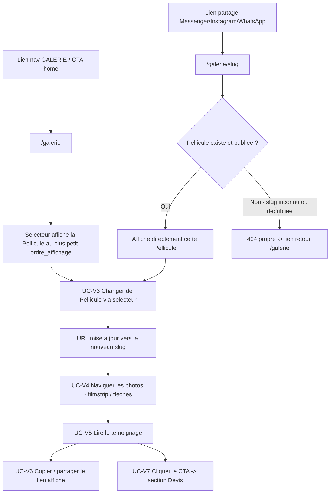
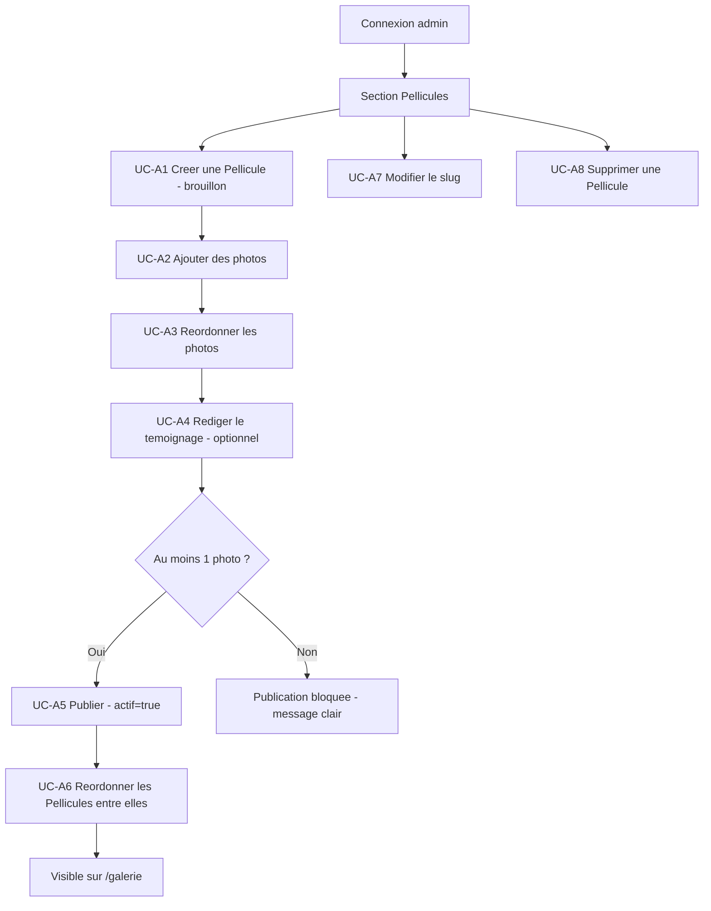

# Module — Galerie complète par Pellicule (page dédiée v2)

> PortfolioPhotographe · Brainstorm module · 2026-07-30
> Fait suite à `FONDATION.md` §2 (fonctionnalité v2 "Page(s) dédiées enrichies —
> galerie filtrable par mariage/catégorie"), laissée ouverte en attendant une session
> dédiée. Remplace l'idée initiale de "galerie filtrable par catégorie" par un concept
> plus narratif : une galerie structurée **par mariage**, pas par tag.

---

## 1. Concept

Une page dédiée (`/galerie`) qui regroupe les meilleures photos d'Ernest **par mariage**
plutôt qu'en grille plate. Chaque mariage est une **Pellicule** — reprend et prolonge la
métaphore argentique déjà en place sur le site (cadran d'exposition du Hero, "Bobine
Nº MMXXVI", mécanisme d'engagement du Dossier — voir `DOSSIER.md` §5). Un seul mariage
est affiché à la fois ; on navigue entre eux via un sélecteur de couples en haut de
page. Chaque Pellicule associe : quelques photos choisies (pas un pool exhaustif — la
discipline éditoriale est volontaire, "surcharger" est explicitement écarté) et le
témoignage des mariés concernés, affiché juste en dessous.

**Distinct de l'extrait "Planche-contact" de la home** (3 photos, catégorie `galerie`
actuelle) — pool totalement séparé et indépendant, qu'Ernest continue de gérer à part
pour faire tourner ses photos phares au fil de ses tournages. Aucune donnée partagée
entre les deux systèmes.

## 2. Design retenu

Importé depuis Claude Design (projet `2300b657-e8df-473b-b3d1-8c938410c29b`,
`Ernest H Photography.dc.html`, turn 7, option **7a** — "Galerie, carrousel central,
sélecteur de couples en cadran, témoignage qui accompagne").

- **Sélecteur de couples** : rangée de cercles façon pellicule (30px), un par mariage,
  flèches ‹ › aux extrémités. Le cercle actif a une bordure bronze pleine opacité, les
  autres sont estompés (~50%). Cliquer sur un cercle change tout : photo principale,
  nom/lieu/date, filmstrip, témoignage.
- **En-tête de Pellicule** : nom du couple (serif italique) + métadonnées en majuscules
  monospace (lieu · date · formule), ex. "CHÂTEAU DE VALMONT · 14 JUIN 2026 · JOURNÉE
  COMPLÈTE".
- **Photo principale** centrée entre deux flèches rondes, anneau pointillé décoratif
  (écho du cadran du Hero), légende façon exposition sous la photo (ex. "Nº07 · 19H10 ·
  ƒ2.0" — décoratif, pas de vraie donnée EXIF, même esprit que le Hero).
- **Filmstrip** de vignettes sous la photo principale — correspond à **toutes** les
  photos de la Pellicule (pas un sous-ensemble d'un pool plus large, contrairement à ce
  que la légende "Nº07 SUR 24" du mock suggérait — confirmé décoratif). Cliquer une
  vignette la définit comme photo principale.
- **Témoignage** isolé sous un trait vertical, citation en italique serif + "PRÉNOM &
  PRÉNOM · FORMULE".
- CTA de fin de page (fond sombre) vers le devis : "Ajoutez votre bobine à la
  collection."
- Pas de version mobile générée spécifiquement pour cette page (le turn 6 du design
  couvrait la home, pas la Galerie) — adaptation responsive à faire en suivant les
  patterns mobile déjà établis sur le reste du site (empilement vertical, cadran
  réduit).

## 3. Contenu d'une Pellicule

- Noms des mariés, lieu, date du mariage, formule (texte libre, ex. "Journée
  complète" — **pas** de FK vers la table `formules` du Devis : une Pellicule peut
  documenter un mariage antérieur au site/CRM, la liberté éditoriale prime).
- Photos choisies (nombre libre, pas de cap technique — discipline éditoriale assumée
  par Ernest).
- Texte témoignage + auteur (optionnel — voir §4.3 UC-V5 #8).
- Statut publié/brouillon (`actif`) — permet de préparer une Pellicule (ajouter photos
  au fur et à mesure) avant de la rendre visible publiquement.
- Ordre d'affichage dans le sélecteur — **manuel**, géré en CMS (pas de tri
  chronologique automatique).

## 4. Workflow utilisateur — Use Cases

Circuit complet à suivre à l'implémentation (Backend/Frontend), et base directe pour
l'Agent Test Engineer (tests unitaires + intégration, niveau code — voir
`~/.claude/agents-workflow.md` Agent #6). Deux parcours distincts : **Visiteur**
(page publique) et **Ernest** (CMS).

### 4.1 Parcours Visiteur

| UC | Déclencheur | Résultat attendu |
|----|-------------|-------------------|
| UC-V1 | Arrivée sur `/galerie` (nav ou CTA home) | Affiche la Pellicule au plus petit `ordre_affichage`, sélecteur complet |
| UC-V2 | Arrivée sur `/galerie/[slug]` (lien partagé) | Affiche directement cette Pellicule si publiée |
| UC-V3 | Clic sur un cercle du sélecteur (ou flèches ‹ ›) | Contenu ET URL se mettent à jour vers la Pellicule choisie |
| UC-V4 | Clic filmstrip ou flèches de la photo principale | Change la photo principale affichée — état client uniquement, URL inchangée |
| UC-V5 | Pellicule affichée | Témoignage visible sous la photo, ou section absente si non renseigné |
| UC-V6 | Visiteur copie/partage l'URL affichée | `/galerie/[slug]` courant, aperçu riche généré (OG titre + image) |
| UC-V7 | Clic sur le CTA de fin de page | Navigation vers la section/page Devis |

### 4.2 Parcours Ernest (CMS)

| UC | Déclencheur | Résultat attendu |
|----|-------------|-------------------|
| UC-A1 | Ernest crée une Pellicule (noms, lieu, date, formule) | Slug auto-généré, statut brouillon par défaut |
| UC-A2 | Ernest ajoute des photos (upload ou bibliothèque Cloudinary) | Photos rattachées à `pellicule_id`, ordonnables |
| UC-A3 | Ernest réordonne les photos d'une Pellicule | La première (`ordre_affichage` le plus bas) devient la photo principale par défaut côté public |
| UC-A4 | Ernest rédige/édite le témoignage | Champ texte + auteur, optionnel |
| UC-A5 | Ernest bascule publié/brouillon | Bloqué si 0 photo (voir §4.3 UC-A5 #14) |
| UC-A6 | Ernest réordonne les Pellicules entre elles | Détermine l'ordre du sélecteur public et la Pellicule par défaut de `/galerie` |
| UC-A7 | Ernest modifie le slug | Validation format + unicité |
| UC-A8 | Ernest supprime une Pellicule | Confirmation 2 clics, cascade DB uniquement, jamais Cloudinary |

### 4.3 Tests & exceptions par use case

| UC | # | Scénario | Comportement attendu |
|----|---|----------|------------------------|
| UC-V1 | 1 | Aucune Pellicule publiée | `/galerie` affiche un état vide explicite ("Bientôt de nouvelles pellicules"), jamais une page cassée |
| UC-V1 | 2 | Une seule Pellicule publiée | Sélecteur affiche un seul cercle, flèches ‹ › masquées/désactivées (rien à naviguer) |
| UC-V2 | 3 | Slug inexistant (faute de frappe, jamais créé) | 404 propre |
| UC-V2 | 4 | Slug existant mais Pellicule dépubliée entre le partage et la visite | 404 propre ou redirection `/galerie`, jamais d'erreur brute |
| UC-V3 | 5 | Clic rapide/répété sur les flèches du sélecteur | Pas de rafale de requêtes ni d'état incohérent |
| UC-V4 | 6 | Pellicule avec une seule photo | Flèches et filmstrip masqués/désactivés (rien à naviguer) |
| UC-V4 | 7 | Beaucoup de photos dans une Pellicule | Filmstrip scrollable horizontalement plutôt que débordant |
| UC-V5 | 8 | Pellicule sans témoignage renseigné | Section masquée proprement, pas de guillemets vides |
| UC-V6 | 9 | Partage du lien avant qu'une image existe | OG image de repli (logo/photo par défaut du site), jamais un aperçu cassé |
| UC-A1 | 10 | Noms des mariés vides | Erreur de validation claire, création bloquée |
| UC-A1 | 11 | Deux Pellicules aux noms identiques (mariages différents) | Slug suffixé automatiquement (`lea-mathieu-2`), pas de collision silencieuse |
| UC-A2 | 12 | Photo déjà utilisée ailleurs (autre Pellicule ou slot du site) | Autorisé — réutilisation libre, pas de garde-fou d'unicité globale |
| UC-A3 | 13 | Réordonnancement pendant qu'un visiteur consulte la Pellicule | Nouvel ordre appliqué au prochain chargement, pas de rupture d'une session déjà ouverte |
| UC-A5 | 14 | Tentative de publication sans photo | Bloqué avec message clair ("Ajoutez au moins une photo avant de publier") — validation proactive côté admin |
| UC-A5 | 15 | Dépublication d'une Pellicule dont le lien est partagé activement | Voir UC-V2 #4 |
| UC-A6 | 16 | Suppression/dépublication de la Pellicule en position 1 | La Pellicule au prochain `ordre_affichage` devient automatiquement la nouvelle Pellicule par défaut de `/galerie` |
| UC-A7 | 17 | Nouveau slug en collision avec un slug existant | Refus avec message clair, jamais d'écrasement silencieux |
| UC-A8 | 18 | Suppression d'une Pellicule ayant des photos | Confirmation à deux clics, cascade DB uniquement, assets Cloudinary jamais touchés |

## 5. Gestion en CMS

Nouvelle section admin **"Pellicules"** (aux côtés de Photos, Textes, Tarifs, Services,
Champs, Leads) :

- Créer/éditer une Pellicule : noms, lieu, date, formule (texte libre), témoignage,
  auteur du témoignage, ordre d'affichage, statut publié/brouillon.
- Gérer les photos de la Pellicule : réutilise l'infrastructure déjà construite pour le
  module Photos (upload direct + bibliothèque Cloudinary — voir la fonctionnalité
  "Bibliothèque Cloudinary" ajoutée au CMS Photos), adaptée pour rattacher à une
  `pellicule_id` plutôt qu'à une `categorie` fixe. Réordonnable (ordre_affichage).
  **Pas de cadrage** (zoom/position) sur ces photos — affichées telles quelles
  (`object-cover` simple), décision explicite de l'utilisateur.
- Slug généré automatiquement depuis les noms des mariés (ex. "Léa & Mathieu" →
  `lea-mathieu`), modifiable manuellement par Ernest (utile en cas de collision ou de
  préférence différente).
- Suppression d'une Pellicule : retire uniquement les références DB (Pellicule +
  lignes `pellicule_photos`), ne touche jamais les assets Cloudinary — même règle que
  pour "Supprimer" dans le module Photos (les photos peuvent appartenir à la
  photothèque personnelle réutilisable d'Ernest).

## 6. Routing & partage

- `/galerie` — page d'index, affiche le sélecteur et la première Pellicule (par ordre
  d'affichage) par défaut.
- `/galerie/[slug]` — lien direct partageable vers une Pellicule précise (**"nec plus
  ultra"** demandé : partage sur Messenger/Instagram/WhatsApp). Passer d'une Pellicule
  à l'autre via le sélecteur met à jour l'URL (navigation Next.js, pas de rechargement
  complet).
- Métadonnées OpenGraph générées par Pellicule (`generateMetadata` Next.js) : titre
  ("Léa & Mathieu — Ernest H. Photography"), description (lieu + date), image = première
  photo de la Pellicule (recadrée automatiquement en 1200×630 via transformation
  Cloudinary à la volée pour l'aperçu de lien).
- Le choix de la photo affichée dans le filmstrip (navigation interne à une Pellicule)
  reste un état d'interface côté client — pas reflété dans l'URL. Seul le niveau
  Pellicule est partageable.

> Cas limites transverses supplémentaires (au-delà de la table §4.3) : navigation
> tactile mobile (flèches ‹ › toujours visibles, jamais de dépendance au survol
> souris) ; beaucoup de Pellicules (10+, sélecteur scrollable horizontalement plutôt
> que débordant) ; ajout de photo à une Pellicule déjà publiée (apparition immédiate
> via `revalidatePath` sur `/galerie` et `/galerie/[slug]`, pas de cache figé).

## 7. Modèle de données

| Entité | Champs clés | Relations |
|--------|-------------|-----------|
| `pellicules` | id, slug (unique), noms_maries, lieu, date_mariage, formule (texte libre), temoignage_citation (nullable), temoignage_auteur (nullable), actif, ordre_affichage, created_at | ← `pellicule_photos` |
| `pellicule_photos` | id, pellicule_id (FK, cascade), url_cloudinary, public_id_cloudinary, titre (nullable), ordre_affichage, created_at | → `pellicules` |

Table dédiée plutôt qu'extension de la table `photos` existante (dont la `categorie`
est un CHECK constraint fermé sur les emplacements uniques du site) — évite de
surcharger un schéma conçu pour des slots fixes avec une logique de collection à
cardinalité variable.

## 8. Sécurité

- RLS Supabase : `pellicules` et `pellicule_photos` — lecture publique restreinte aux
  lignes où `pellicules.actif = true` (jointure), écriture réservée à l'admin
  (`is_admin()`, même pattern que `photos`/`contenus_site`).
- Validation serveur du slug (format URL-safe, unicité) à la création/édition — jamais
  confiance dans une saisie manuelle non normalisée.
- Même garde-fou que le module Photos : aucune Server Action de ce module n'appelle
  jamais l'API de suppression Cloudinary.

## 9. Points laissés à l'appréciation d'Ernest (par défaut, ajustable)

- Témoignage optionnel, photos obligatoires (au moins 1 pour publier).
- `formule` en texte libre, pas de lien vers la table `formules` du Devis.
- Slug auto-généré mais toujours modifiable manuellement.

## 10. Prochaines étapes

- [ ] Migration `pellicules` + `pellicule_photos` (RLS incluse)
- [ ] Nouvelle section CMS "Pellicules" (CRUD + gestion photos, réutilise la
      bibliothèque Cloudinary du module Photos)
- [ ] Page publique `/galerie` + `/galerie/[slug]` (sélecteur, carrousel, filmstrip,
      témoignage, OpenGraph dynamique)
- [ ] Adaptation responsive mobile (pas de mock dédié — suivre les patterns établis)
